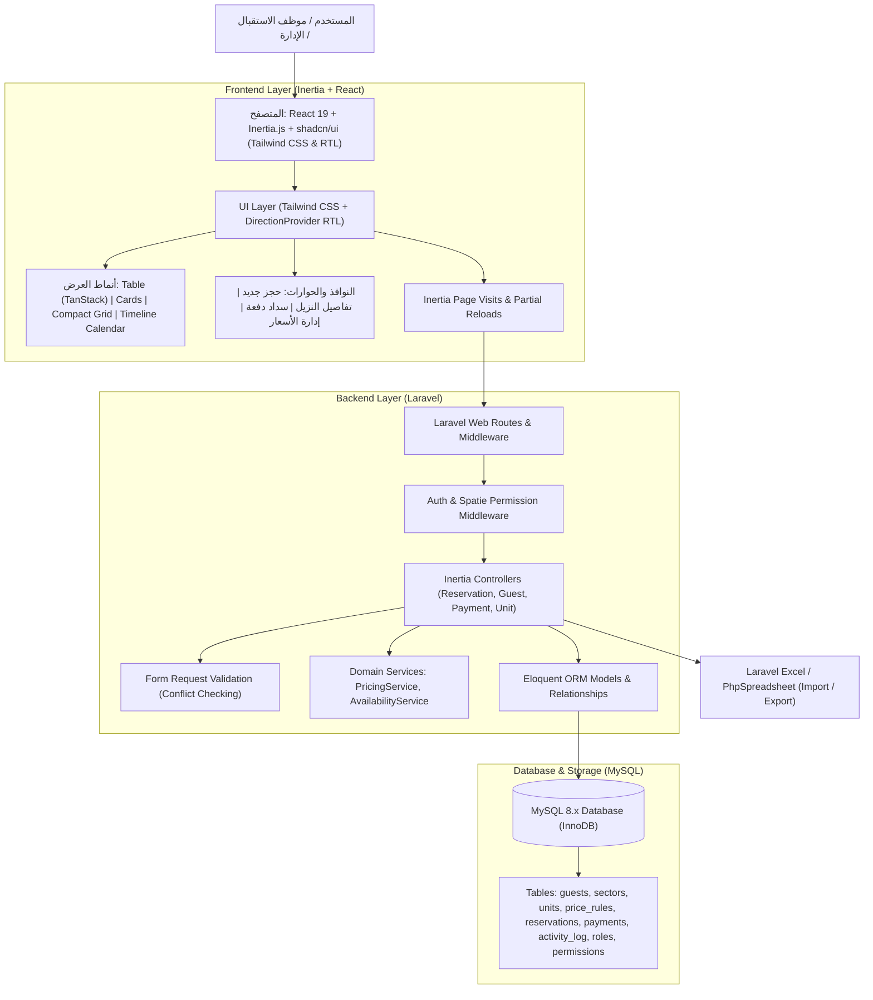
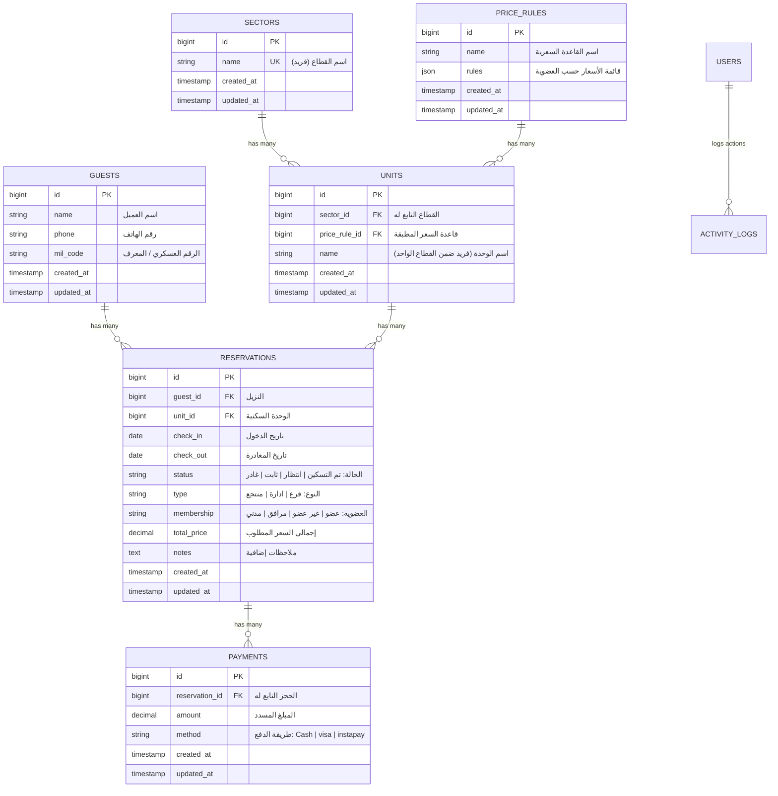
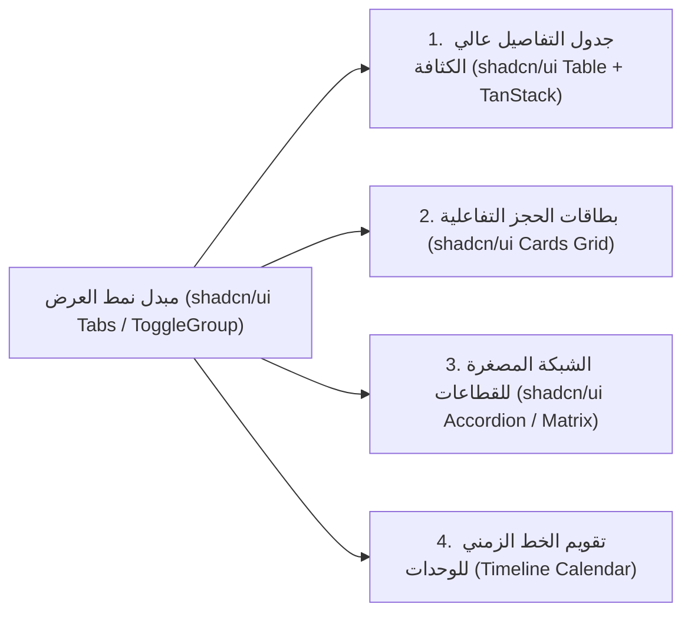

# وثيقة متطلبات المنتج (PRD) - نظام إدارة حجوزات منتجع إيجلز
# Product Requirements Document (PRD) - Eagles Resort Reservation Management System

---

## 1. نظرة عامة ورؤية المنتج (Executive Summary & Product Vision)

### 1.1 نبذة عن المشروع (Product Overview)
**نظام إدارة الحجوزات لمنتجع إيجلز (Eagles Resort Reservation Management System)** هو تطبيق ويب متكامل لإدارة المنشآت الفندقية والسياحية، مبني على أحدث المعايير البرمجية باستخدام معمارية **Laravel** كخادم خلفي متين، و**React** مع **Inertia.js** لواجهة مستخدم أمامية أحادية الصفحة (SPA) فائقة السرعة، ومكتبة المكونات الحديثة **shadcn/ui** (المبنية على **Tailwind CSS** و **Radix UI**) الداعمة بالكامل للغة العربية والاتجاه من اليمين لليسار (RTL).

يعتمد النظام على قاعدة بيانات علائقية مركزية **MySQL** لضمان تكامل وسلامة البيانات، ويلتزم بمعايير المعاملات المالية (ACID Transactions) لصالح بنية تحتية احترافية قابلة للتوسع وتدعم التدقيق المحكم، وتعدد طرق الدفع، ونظام تسعير ديناميكي ذكي، ومنظومة متقدمة للأدوار والصلاحيات مدعومة بحزمة **Spatie Laravel Permission**.

### 1.2 أهداف النظام الأساسية (Key Objectives)
1. **قاعدة بيانات مركزية علائقية (MySQL)**: إدارة محكمة ومترابطة للبيانات عبر المفاتيح الأجنبية والفهارس، مما ينهي عيوب التزامن ومشاكل فقدان البيانات الناتجة عن الاعتماد السابق على Google Sheets.
2. **منع التضارب والازدواجية (Conflict Prevention Engine)**: كشف آلي وفوري لأي تعارض في تواريخ التسكين (`check_in` و `check_out`) لنفس الوحدة السكنية على مستوى الخادم (Database Queries) وواجهة المستخدم قبل تأكيد الحجز.
3. **هيكلة مرنة للأسعار والوحدات (Dynamic Pricing Rules)**: ربط كل وحدة سكنية بقاعدة تسعير (`PriceRule`) تحدد تلقائياً تكلفة الليلة حسب تصنيف عضوية النزيل (`عضو`، `غير عضو`، `مرافق`، `مدني`).
4. **تعددية طرق العرض (Multi-View UI with shadcn/ui)**: توفير 4 أنماط عرض تفاعلية عالية الكثافة (جدول تفاعلي غني بالإجراءات السريعة، بطاقات مرنة، شبكة القطاعات المصغرة، وتقويم جدول زمني للوحدات).
5. **إدارة مالية دقيقة ومتعددة الدفعات (Multi-Payment Tracking)**: تمكين تسجيل دفعات مالية متعددة للحجز الواحد (كاش، فيزا، إنستاباي) مع احتساب تلقائي للمسدد والمتبقي وحالة السداد.
6. **إدارة دقيقة للأدوار والصلاحيات (RBAC with Spatie)**: حماية النظام بمستويات وصول مخصصة وصلاحيات محددة عبر حزمة `spatie/laravel-permission` لحماية العمليات الحساسة كالأسعار، والحذف، والتقارير.
7. **استيراد وتصدير إكسيل عبر الخادم (Server-Side Excel Processing)**: استيراد وتصدير دفعات الحجوزات والوحدات بصيغ `.xlsx` مباشرة إلى قاعدة بيانات MySQL عبر خادم Laravel دون الاعتماد على أدوات وسيطة.

---

## 2. البنية التقنية والمنظومة البرمجية (System Architecture & Tech Stack)



### 2.1 مواصفات حزمة الواجهة الأمامية (Frontend Stack)
- **الإطار البرمجي**: React 19 مع TypeScript.
- **جسر الربط الأحادي**: **Inertia.js v2/v3** (لتوفير تجربة Single Page Application سلسة دون الحاجة لبناء REST API أو GraphQL منفصلة، مع الاستفادة الكاملة من توجيهات وحماية Laravel).
- **مكتبة المكونات الرسومية**: **shadcn/ui** (مبنية على **Tailwind CSS** و **Radix UI**):
  - دعم أصيل ومتكامل للاتجاه من اليمين لليسار (RTL) واللغة العربية عبر خاصية `dir="rtl"` ومزود الاتجاه `@radix-ui/react-direction` مع فئات Tailwind CSS الداعمة للاتجاهين.
  - نظام ألوان وتصميم حديث ومرن يعتمد على متغيرات CSS (CSS Variables / Design Tokens) لدعم الوضعين الداكن والفاتح (Dark / Light Mode) وملاءمة بيئات العمل المكثفة.
  - بناء الجداول التفاعلية المتقدمة بالاعتماد على **`@tanstack/react-table`** المتكامل مع مكونات جدول shadcn/ui.
- **الأيقونات**: مكتبة **`lucide-react`** القياسية والمعتمدة في shadcn/ui.
- **معالجة التواريخ والتقويم**: مكتبة **`date-fns`** (مع `date-fns/locale/ar-EG` لدعم التنسيق والتوطين العربي) ومكون التقويم ومحدد الفترات **`react-day-picker`** المدمج في مكونات `shadcn/ui Calendar` و `Popover`.

### 2.2 مواصفات حزمة الخادم الخلفي (Backend Stack)
- **الإطار البرمجي**: **Laravel 11.x / 12.x** يعمل على بيئة **PHP 8.3+**.
- **المصادقة وإدارة الجلسات**: Laravel Session Authentication (Inertia Auth Pipeline).
- **نظام الأدوار والصلاحيات (RBAC)**: حزمة **`spatie/laravel-permission`**:
  - فحص الصلاحيات عبر Middleware في المسارات: `role:admin`, `permission:reservations.create`.
  - مشاركة مصفوفة صلاحيات المستخدم الحالي تلقائياً إلى خادم Inertia عبر `HandleInertiaRequests` لتمكين واجهات React من إظهار وإخفاء الأزرار والإجراءات ديناميكياً.
- **معالجة ملفات الإكسيل**: حزمة `maatwebsite/excel` أو مكتبة `phpoffice/phpspreadsheet` لاستيراد وتصدير بيانات الحجوزات والوحدات من وإلى قاعدة البيانات مباشرة.
- **سلامة البيانات والمعاملات**: استخدام `DB::transaction()` لحركات الحجز والسداد لمنع أي حالة عدم اتساق مالي.

### 2.3 مواصفات قاعدة البيانات (Database Stack)
- **محرك قاعدة البيانات**: **MySQL 8.x** بمحرك التخزين **InnoDB** لدعم المفاتيح الأجنبية والعمليات التبادلية (Transactions).
- **الترميز ومحاذاة الحروف**: `utf8mb4_unicode_ci` لدعم كامل وفوري لجميع الحروف والرموز العربية.
- **مبدأ إدارة الحقول المشروطة (Enums)**:
  > [!IMPORTANT]
  > **قاعدة حتمية**: تُعرف كافة القيم الثابتة (Enums) على مستوى طبقة التطبيق (PHP Backed Enums & TypeScript Union Types)، وتُخزن في جداول قاعدة البيانات كحقول نصية عادية (`VARCHAR` / `string`) لضمان السهولة والمرونة في الصيانة والتوسعات المستقبلية دون الحاجة لتعديل قيود `ALTER TABLE ENUM`.

---

## 3. تقسيم القطاعات والوحدات الفندقية (Resort Sector Taxonomy)

يتم تخزين القطاعات والوحدات الفندقية ديناميكياً داخل جداول قاعدة البيانات (`sectors` و `units`)، مما يتيح للإدارة إضافة وتعديل وحذف القطاعات والوحدات بحرية كاملة دون تعديل الكود البرمجي. 

تتضمن البيانات التأسيسية للنظام (Seeders) القطاعات الرئيسية التالية:

| # | اسم القطاع (`name`) | التوصيف والنوع | طبيعة الوحدات التابعة |
|---|---|---|---|
| 1 | **لوسيال (Le Ciel)** | شاليهات ووحدات قطاع لوسيال المميزة المطلة | شاليهات أرضية وعلوية |
| 2 | **فيلا قديم (Old Villa)** | الفيلات الكلاسيكية للضباط والأعضاء | فيلات مستقلة بطابع كلاسيكي |
| 3 | **فيلا جديد (New Villa)** | الفيلات المطورة حديثاً داخل المنتجع | فيلات مجهزة بطراز حديث |
| 4 | **فندق 1 (Hotel 1)** | مبنى الفندق رقم 1 | غرف وأجنحة فندقية |
| 5 | **فندق 2 (Hotel 2)** | مبنى الفندق رقم 2 | غرف وأجنحة فندقية |
| 6 | **فندق 3 (Hotel 3)** | مبنى الفندق رقم 3 | غرف وأجنحة فندقية |
| 7 | **فندق 4 (Hotel 4)** | مبنى الفندق رقم 4 | غرف وأجنحة فندقية |
| 8 | **فندق 5 (Hotel 5)** | مبنى الفندق رقم 5 | غرف وأجنحة فندقية |
| 9 | **فندق 6 (Hotel 6)** | القطاع الفندقي الشامل (إقامة متميزة وخدمات خاصة) | غرف وأجنحة متعددة السعة |
| 10 | **مميز (Distinguished)** | أجنحة وغرف الإقامة الخاصة لكبار الزوار | أجنحة فندقية فاخرة |
| 11 | **دورين (Duplex Units)** | وحدات الدوبلكس المكونة من طابقين | وحدات عائلية واسعة |
| 12 | **أخرى / غير مصنف** | وحدات مرنة أو مرافق سياحية مؤقتة | مرافق متغيرة |

---

## 4. نموذج وهيكل البيانات (Data Model & Schema Specifications)

### 4.1 مخطط الكيانات والعلاقات (Entity Relationship Diagram - ERD)



---

### 4.2 تفاصيل الجداول والكيانات البرمجية (Entities Specification)

#### 1. كيان النزيل (Guest Entity)
يمثل النزيل المسجل في المنتجع وبيانات التواصل والملف العسكري الخاص به.
- **الحقول الأساسية**:
  - `id`: المعرف الرقمي الأساسي (BigInt Auto-increment PK).
  - `name`: اسم النزيل بالكامل (`string`, إلزامي).
  - `phone`: رقم هاتف التواصل (`string`, إلزامي، مفهرس `index`).
  - `mil_code`: الرقم / الكود العسكري أو القيد الوظيفي (`string`, اختياري/يقبل `null`).
  - `created_at`, `updated_at`: تواريخ الإنشاء والتحديث التلقائية.
- **العلاقات (Relationships)**:
  - `hasMany(Reservation::class)`: النزيل يمتلك سجلاً تاريخياً لعدة حجوزات.

#### 2. كيان قاعدة التسعير (Price Rule Entity)
يحدد سعر الإقامة اليومي لكل وحدة سكنية استناداً إلى تصنيف عضوية النزيل.
- **الحقول الأساسية**:
  - `id`: المعرف الرقمي الأساسي (PK).
  - `name`: مسمى القاعدة السعرية (مثال: "تسعير شاليهات لوسيال صيف 2026").
  - `rules`: حقل كائن **JSON** يحتوي على الأسعار المقابلة لكل نوع عضوية بالجنيه المصري:
    ```json
    {
      "عضو": 450.00,
      "غير عضو": 750.00,
      "مرافق": 600.00,
      "مدني": 900.00
    }
    ```
  - `created_at`, `updated_at`: التوقيتات القياسية.
- **العلاقات (Relationships)**:
  - `hasMany(Unit::class)`: يمكن تطبيق قاعدة التسعير على أكثر من وحدة سكنية.

#### 3. كيان القطاع (Sector Entity)
يمثل التوزيع الجغرافي والإداري للأقسام والفنادق داخل المنتجع.
- **الحقول الأساسية**:
  - `id`: المعرف الرقمي الأساسي (PK).
  - `name`: اسم القطاع (`string`, قيد فريد `unique` على مستوى النظام مثل "لوسيال", "فندق 6").
  - `created_at`, `updated_at`: التوقيتات القياسية.
- **العلاقات (Relationships)**:
  - `hasMany(Unit::class)`: يحتوي القطاع على عدد من الوحدات السكنية.

#### 4. كيان الوحدة السكنية (Unit Entity)
يمثل الغرفة أو الشاليه أو الفيلا المحددة للتسكين.
- **الحقول الأساسية**:
  - `id`: المعرف الرقمي الأساسي (PK).
  - `sector_id`: معرف القطاع التابع له (`bigint unsigned FK` مرتبط بجدول `sectors`).
  - `price_rule_id`: معرف قاعدة التسعير المطبقة (`bigint unsigned FK` مرتبط بجدول `price_rules`, يقبل `null`).
  - `name`: اسم الوحدة أو رقمها (مثال: "101", "فيلا 4", "شاليه 12").
    - **قيد الخصوصية**: الاسم فريد حصراً داخل نفس القطاع (`unique(['sector_id', 'name'])`)، مما يسمح بتكرار مسمى "غرفة 101" في فندق 1 وفندق 2 دون أي تضارب.
  - `created_at`, `updated_at`: التوقيتات القياسية.
- **العلاقات (Relationships)**:
  - `belongsTo(Sector::class)`: تتبع قطاعاً واحداً.
  - `belongsTo(PriceRule::class)`: تتبع قاعدة تسعير واحدة.
  - `hasMany(Reservation::class)`: ترتبط بالعديد من الحجوزات عبر الزمن.

#### 5. كيان الحجز (Reservation Entity)
يمثل عملية حجز وإشغال وحدة معينة من قبل نزيل خلال فترة زمنية محددة.
- **الحقول الأساسية**:
  - `id`: المعرف الرقمي الأساسي (PK).
  - `guest_id`: معرف النزيل (`bigint unsigned FK` مرتبط بجدول `guests`).
  - `unit_id`: معرف الوحدة السكنية (`bigint unsigned FK` مرتبط بجدول `units`).
  - `check_in`: تاريخ بدء الإقامة والتسكين (`date`).
  - `check_out`: تاريخ المغادرة وإخلاء الوحدة (`date`).
  - `status`: حالة الحجز الحالية (`string` في قاعدة البيانات):
    - قيم التطبيق: `"تم التسكين"` | `"انتظار"` | `"ثابت"` | `"غادر"`.
  - `type`: جهة أو مصدر توجيه الحجز (`string` في قاعدة البيانات):
    - قيم التطبيق: `"فرع"` | `"ادارة"` | `"منتجع"`.
  - `membership`: نوع العضوية المعتمد للحساب المالي (`string` في قاعدة البيانات):
    - قيم التطبيق: `"عضو"` | `"غير عضو"` | `"مرافق"` | `"مدني"`.
  - `total_price`: إجمالي التكلفة المستحقة للحجز بالجنيه المصري (`decimal(10,2)`).
  - `notes`: ملاحظات وطلبات خاصة بالنزيل أو إرشادات الاستقبال (`text`, يقبل `null`).
  - `created_at`, `updated_at`: التوقيتات القياسية.
- **الحقول المحسوبة برمجياً (Computed / Accessors)**:
  - `paid_amount`: مجموع كافة المدفوعات المسجلة لهذا الحجز (`sum(payments.amount)`).
  - `balance`: المبلغ المتبقي غير المسدد (`total_price - paid_amount`).
  - `nights_count`: عدد ليالي الإقامة الفعلي (`check_out - check_in`).
  - `payment_status`: تصنيف حالة السداد ("مسدد بالكامل" | "مدفوع جزئياً" | "غير مسدد").
- **العلاقات (Relationships)**:
  - `belongsTo(Guest::class)`: يرتبط بنزيل محدد.
  - `belongsTo(Unit::class)`: يرتبط بوحدة سكنية محددة.
  - `hasMany(Payment::class)`: يحتوي على دفعة أو دفعات سداد مالية متعددة.

#### 6. كيان الدفعة المالية (Payment Entity)
يوثق كل حركة تحصيل مالي تمت لصالح الحجز.
- **الحقول الأساسية**:
  - `id`: المعرف الرقمي الأساسي (PK).
  - `reservation_id`: معرف الحجز المرتبط (`bigint unsigned FK` مرتبط بجدول `reservations` مع خيار `cascade on delete`).
  - `amount`: قيمة المبلغ المسدد بالجنيه المصري (`decimal(10,2)`, إلزامي وقيمة موجبة أكبر من صفر).
  - `method`: وسيلة الدفع المعتمدة (`string` في قاعدة البيانات):
    - قيم التطبيق: `"Cash"` | `"visa"` | `"instapay"`.
  - `created_at`, `updated_at`: تاريخ وتوقيت تسجيل الدفعة.
- **العلاقات (Relationships)**:
  - `belongsTo(Reservation::class)`: يرتبط بالحجز التابع له.

---

### 4.3 تعريف القيم الثابتة في طبقة التطبيق (Application Enums & DB Representation)

> [!NOTE]
> تطبيقاً لمبدأ: **"Any enum in application level is string in db level"**، يتم تعريف القيم في لغة PHP كـ `Backed Enums` من النوع `string`، وفي لغة TypeScript كـ `String Literal Unions`.

#### كود تعريف قيم PHP (Application Layer Backed Enums):
```php
namespace App\Enums;

enum ReservationStatus: string
{
    case CHECKED_IN = 'تم التسكين';
    case WAITING    = 'انتظار';
    case CONFIRMED  = 'ثابت';
    case DEPARTED   = 'غادر';
}

enum ReservationType: string
{
    case BRANCH     = 'فرع';
    case MANAGEMENT = 'ادارة';
    case RESORT     = 'منتجع';
}

enum MembershipType: string
{
    case MEMBER         = 'عضو';
    case NON_MEMBER     = 'غير عضو';
    case COMPANION      = 'مرافق';
    case CIVILIAN       = 'مدني';
}

enum PaymentMethod: string
{
    case CASH     = 'Cash';
    case VISA     = 'visa';
    case INSTAPAY = 'instapay';
}
```

#### كود تعريف أنواع TypeScript (Frontend Application Layer):
```typescript
export type ReservationStatus = 'تم التسكين' | 'انتظار' | 'ثابت' | 'غادر';
export type ReservationType = 'فرع' | 'ادارة' | 'منتجع';
export type MembershipType = 'عضو' | 'غير عضو' | 'مرافق' | 'مدني';
export type PaymentMethod = 'Cash' | 'visa' | 'instapay';

export interface Guest {
  id: number;
  name: string;
  phone: string;
  mil_code?: string | null;
  created_at: string;
  updated_at: string;
}

export interface PriceRule {
  id: number;
  name: string;
  rules: Record<MembershipType, number>;
  created_at: string;
  updated_at: string;
}

export interface Sector {
  id: number;
  name: string;
  units_count?: number;
  created_at: string;
  updated_at: string;
}

export interface Unit {
  id: number;
  sector_id: number;
  name: string;
  price_rule_id?: number | null;
  sector?: Sector;
  price_rule?: PriceRule | null;
  created_at: string;
  updated_at: string;
}

export interface Payment {
  id: number;
  reservation_id: number;
  amount: number;
  method: PaymentMethod;
  created_at: string;
  updated_at: string;
}

export interface Reservation {
  id: number;
  guest_id: number;
  unit_id: number;
  check_in: string; // YYYY-MM-DD
  check_out: string; // YYYY-MM-DD
  status: ReservationStatus;
  type: ReservationType;
  membership: MembershipType;
  total_price: number;
  paid_amount: number;
  balance: number;
  notes?: string | null;
  guest?: Guest;
  unit?: Unit;
  payments?: Payment[];
  created_at: string;
  updated_at: string;
}
```

---

## 5. الأدوار وصلاحيات الأمان عبر Spatie (Roles & Permissions with Spatie)

يتم تشغيل التحكم في الوصول القائم على الأدوار (RBAC) باستخدام حزمة **`spatie/laravel-permission`** المعتمدة، مع حفظ كافة الصلاحيات والأدوار في جداول قاعدة البيانات ومراقبتها في كل طلب للمتصفح.

### 5.1 قائمة الأدوار المعتمدة (System Roles)
1. **المدير العام (Super Admin)**: صلاحيات مطلقة لإدارة النظام والمستخدمين والأدوار وقواعد التسعير وحذف السجلات وتصدير التقارير.
2. **مدير الاستقبال / مشرف العمليات (Admin)**: صلاحيات كاملة لإدارة الوحدات والحجوزات والمدفوعات والنزلاء وتعديل التسكين.
3. **موظف الاستقبال (Receptionist / Staff)**: إضافة حجوزات جديدة، تعديل بيانات التواصل، تسجيل المدفوعات وتحديث حالة التسكين (بدون صلاحية الحذف أو التعديل في قواعد الأسعار).
4. **مراجع الحسابات / مشاهد (Auditor / Viewer)**: استعراض الحجوزات والتقارير والبحث والطباعة فقط دون إمكانية الإضافة أو التعديل أو الحذف (Read-only).

### 5.2 مصفوفة الصلاحيات التفصيلية (Permissions Matrix)

| الصلاحية (Permission) | التوصيف البرمجي | Super Admin | Admin | Receptionist | Viewer |
|---|---|:---:|:---:|:---:|:---:|
| **عرض الحجوزات** | `reservations.view` | ✅ | ✅ | ✅ | ✅ |
| **إضافة حجز جديد** | `reservations.create` | ✅ | ✅ | ✅ | ❌ |
| **تعديل بيانات الحجز** | `reservations.edit` | ✅ | ✅ | ✅ | ❌ |
| **تغيير حالة التسكين** | `reservations.update_status` | ✅ | ✅ | ✅ | ❌ |
| **حذف حجز** | `reservations.delete` | ✅ | ✅ | ❌ | ❌ |
| **تجاوز السعر التلقائي يدويًا** | `reservations.override_price` | ✅ | ✅ | ❌ | ❌ |
| **تسجيل دفعة مالية** | `payments.create` | ✅ | ✅ | ✅ | ❌ |
| **حذف أو تسوية دفعة مالية** | `payments.delete` | ✅ | ✅ | ❌ | ❌ |
| **إدارة النزلاء (إضافة/تعديل)** | `guests.manage` | ✅ | ✅ | ✅ | ❌ |
| **إدارة القطاعات والوحدات** | `units.manage` | ✅ | ✅ | ❌ | ❌ |
| **إدارة وتعديل قواعد الأسعار** | `price_rules.manage` | ✅ | ✅ | ❌ | ❌ |
| **استيراد ملفات إكسيل مجمعة** | `excel.import` | ✅ | ✅ | ❌ | ❌ |
| **تصدير التقارير وسجلات الحسابات** | `reports.export` | ✅ | ✅ | ✅ | ✅ |
| **إدارة المستخدمين والأدوار** | `users.manage` | ✅ | ❌ | ❌ | ❌ |
| **استعراض سجل التدقيق التاريخي** | `activity_logs.view` | ✅ | ✅ | ❌ | ❌ |

### 5.3 مشاركة الصلاحيات مع واجهة React عبر Inertia
يتم إرفاق قائمة الصلاحيات الخاصة بالمستخدم المسجل تلقائياً في استجابة خادم Inertia المشتركة عبر فئة `HandleInertiaRequests`:

```php
// app/Http/Middleware/HandleInertiaRequests.php
public function share(Request $request): array
{
    return array_merge(parent::share($request), [
        'auth' => [
            'user' => $request->user() ? [
                'id' => $request->user()->id,
                'name' => $request->user()->name,
                'email' => $request->user()->email,
                'roles' => $request->user()->getRoleNames(),
                'permissions' => $request->user()->getAllPermissions()->pluck('name'),
            ] : null,
        ],
    ]);
}
```

في جانب واجهة React، تتوفر دالة مساعدة `usePermission()` أو مكون `<Can permission="...">` للتحكم المشروط في إظهار أزرار الإجراءات (مثل إخفاء زر الحذف عن موظف الاستقبال والمشاهد).

---

## 6. المتطلبات والوظائف التفصيلية للمنتج (Detailed Functional Requirements)

### 6.1 محرك منع التعارض والتضارب الزمني (Conflict Detection Engine)
- **مبدأ منع الحجز المزدوج (Double-Booking Prevention)**:
  لا يُسمح إطلاقاً بإنشاء أو تحديث حجز لوحدة سكنية بحيث يتقاطع مداه الزمني مع حجز قائم لنفس الوحدة (باستثناء الحجوزات التي غادرت أو أُلغيت).
- **الخوارزمية الرياضية للتعارض الزمني**:
  $$\text{Overlap} \iff (\text{new\_check\_in} < \text{existing\_check\_out}) \land (\text{new\_check\_out} > \text{existing\_check\_in})$$
- **التحقق على مستوى الخادم (Backend Validation Rule)**:
  يتم تنفيذ فحص التعارض داخل كائن `ReservationRequest` قبل حفظ السجل في قاعدة البيانات، مع استثناء معرف الحجز الحالي (`id != $currentId`) عند التعديل:
  ```php
  $hasConflict = Reservation::where('unit_id', $unitId)
      ->where('id', '!=', $reservationId)
      ->where('status', '!=', ReservationStatus::DEPARTED->value)
      ->where(function ($query) use ($checkIn, $checkOut) {
          $query->where('check_in', '<', $checkOut)
                ->where('check_out', '>', $checkIn);
      })
      ->exists();
  ```
  عند ثبوت التعارض، يُرجع الخادم خطأ التحقق مع رسالة توضح اسم النزيل المتضارب وتاريخ الحجز القائم.
- **الفحص اللحظي في واجهة المستخدم (UI Real-time Conflict Alert)**:
  أثناء تعبئة نموذج الحجز في نافذة الحوار (shadcn/ui Dialog)، يتم إرسال استعلام فحص فوري أو مقارنة النطاق الزمني بالتقويم المخبأ، ويظهر شريط تنبيهي مضيء تحذيري (`<Alert variant="destructive" />`) فوراً في حال اختيار فترة زمنية مشغولة مسبقاً.

---

### 6.2 محرك احتساب الأسعار الديناميكي (Dynamic Pricing Calculation)
- بمجرد قيام الموظف باختيار:
  1. **الوحدة السكنية (`unit_id`)**: التي تستدعي تلقائياً قاعدة التسعير المرتبطة بها (`price_rule`).
  2. **نوع العضوية (`membership`)**: اختيار أحد التصنيفات (`عضو`, `غير عضو`, `مرافق`, `مدني`).
  3. **تواريخ الإقامة (`check_in` و `check_out`)**: احتساب عدد الليالي ($N = \text{check\_out} - \text{check\_in}$).
- **صيغة الاحتساب التلقائي**:
  $$\text{Total Price} = N \times \text{PriceRule.rules}[\text{membership}]$$
- **التجاوز اليدوي للسعر (Price Override)**:
  يتم تعبئة حقل `total_price` تلقائياً، ولكن يُسمح لمديري النظام (أصحاب صلاحية `reservations.override_price`) بتعديل الإجمالي يدوياً لتطبيق خصومات أو رسوم استثنائية مع تسجيل سبب التعديل في الملاحظات.

---

### 6.3 إدارة المدفوعات المتعددة وتتبع الأرصدة (Payment Processing)
- **تعدد الدفعات للحجز الواحد**:
  يدعم كل حجز إمكانية إضافة عدة دفعات متتابعة عبر نافذة الحوار للدفع السريع (`PaymentDialog` باستخدام shadcn/ui `Dialog`).
- **طرق الدفع المدعومة**:
  - `Cash` (نقدي بالخزينة).
  - `visa` (بطاقة دفع إلكتروني عبر أجهزة نقاط البيع POS).
  - `instapay` (تحويل فوري عبر تطبيق إنستاباي البنكي مع تسجيل الرقم المرجعي للعملية).
- **التحديث التلقائي للحسابات المالية**:
  - $\text{Paid Amount} = \sum \text{payments.amount}$
  - $\text{Balance} = \text{total\_price} - \text{paid\_amount}$
- **مؤشرات السداد الذكية (shadcn/ui Badges & Progress Bars)**:
  - **مسدد بالكامل** (`balance == 0`): شارة خضراء وسجل مقفل مالياً (`Badge`).
  - **مدفوع جزئياً / عربون** (`paid_amount > 0` و `balance > 0`): شارة برتقالية توضح المتبقي وشريط تقدم (`Progress`) يوضح نسبة السداد.
  - **غير مسدد** (`paid_amount == 0`): شارة حمراء تحذيرية (`Badge variant="destructive"`) لموظف الاستقبال.

---

### 6.4 إدارة النزلاء وقاعدة البيانات العسكرية (Guest Management)
- نافذة إدخال وبحث ذكية مبنية باستخدام مكون shadcn/ui `Combobox` (عبر `Command` و `Popover`) بخاصية البحث والفلترة الآلية السريعة.
- يمكن لموظف الاستقبال البحث عن النزيل بواسطة (الاسم، رقم الهاتف، أو الرقم العسكري `mil_code`).
- في حال كان النزيل جديداً، يتم إنشاؤه مباشرة من داخل نافذة الحجز دون الحاجة لمغادرة الشاشة الحالية (Dialog-in-Dialog or Sheet Drawer).

---

### 6.5 أنماط العرض الأربعة المتعددة باستخدام shadcn/ui (Multi-View UI)

تعتمد الواجهة مبدل عرض رئيسي سلس يتيح للمستخدم التبديل بنقرة واحدة بين 4 أنماط عرض متقدمة:



#### النمط 1: جدول التفاصيل عالي الكثافة (High-Density shadcn/ui Table)
- مبني على مكونات `<Table />` من shadcn/ui بالاشتراك مع حزمة `@tanstack/react-table` لتحقيق أقصى درجات المرونة والأداء.
- **تحكم فائق بالبيانات**:
  - تصنيف وترتيب ديناميكي للأعمدة (Sorting) حسب تاريخ الدخول، المبلغ المتبقي، اسم النزيل، القطاع.
  - فلاتر مدمجة داخل ترويسات الأعمدة للفرز السريع حسب الحالة ونوع العضوية والقطاع.
  - صفوف قابلة للتوسعة (Expandable Rows) لعرض سجل الدفعات التفصيلية لكل حجز (التاريخ، المبلغ، وسيلة الدفع Cash/Visa/InstaPay).
- **التحرير والتحديث السريع**:
  - إمكانية تحديث حالة الحجز مباشرة عبر قائمة منسدلة أنيقة في الجدول (`<Select />` من shadcn/ui).
  - أزرار إجراءات مدمجة (`DropdownMenu`): تعديل الحجز، إضافة دفعة مالية، استعراض البطاقة الكاملة، مراسلة واتساب، وحذف الحجز (حسب الصلاحيات).

#### النمط 2: بطاقات الحجز التفاعلية (Responsive Cards View)
- مبني على مكونات `<Card />` وشبكة Tailwind CSS المتجاوبة تماماً مع الشاشات المتوسطة والأجهزة اللوحية (iPads).
- إبراز حالة التسكين والقطاع بواسطة شارات shadcn/ui الملونة (`<Badge variant="...">`).
- بطاقة مدمجة تلخص تواريخ الإقامة، إجمالي السعر، المبلغ المسدد، ورمز وسيلة الدفع، مع أزرار سريعة للاتصال والمراسلة.

#### النمط 3: الشبكة المصغرة للقطاعات (Compact Sector Matrix View)
- مبني على مكون القوائم المطوية والأكورديون (`<Accordion />` أو `<Collapsible />` من shadcn/ui) لتجميع الوحدات تحت قطاعاتها الإدارية (لوسيال، فيلا قديم، فندق 6، إلخ).
- يوفر مؤشراً بصرياً فورياً لحالة كل وحدة سكنية:
  - **أخضر**: تم التسكين حالياً بنزيل.
  - **أزرق**: حجز ثابت مؤكد بانتظار الوصول.
  - **برتقالي**: حجز قيد الانتظار.
  - **رمادي / شفاف**: وحدة شاغرة تماماً وجاهزة للتسكين.
- إمكانية النقر على أي وحدة شاغرة لفتح نافذة حجز فوري جديدة (`Dialog`) مع تحديد الوحدة والقطاع تلقائياً.

#### النمط 4: تقويم الخط الزمني للوحدات (Timeline & Unit Occupancy Calendar)
- جدول زمني مرئي أفقي (أيام الشهر / الأسبوع) مقابل الوحدات السكنية في المحور الرأسي.
- رسم فترات الإقامة كأشرطة زمنية ملونة فوق الأيام المقابلة للحجز.
- **تنبيه التضارب البصري**: إذا تم رصد أي تداخل، يظهر الشريط الزمني بإطار أحمر وتنبيه وميضي فوري يوضح تعارض التواريخ.

---

### 6.6 لوحة المؤشرات والإحصاءات الحية (KPI Dashboard)
تعتمد على مكونات `<Card />` و `<CardHeader>` و `<CardContent>` مع نصوص رقمية إحصائية وتنسيقات Tailwind CSS المريحة، متصلة بفلاتر سريعة لفرز القائمة بنقرة واحدة:
1. **إجمالي الحجوزات (Total Reservations)**: إجمالي عدد الحجوزات النشطة والإيراد المالي المتوقع.
2. **تم التسكين (Checked-In Guests)**: عدد النزلاء المتواجدين حالياً بالمنتجع ونسبة إشغال الطاقة الاستيعابية.
3. **قيد الانتظار (Pending / Waiting)**: عدد الحجوزات غير المؤكدة أو التي لم تسدد العربون.
4. **حجز ثابت ومؤكد (Confirmed Bookings)**: عدد الحجوزات المؤكدة مع احتساب إجمالي المبالغ المتبقية الواجب تحصيلها.
5. **غادر المنتجع (Departed)**: عدد الحجوزات المنتهية للوحدات المفرغة الجاهزة لإعادة النظافة والتسكين.

---

### 6.7 محرك البحث والفلترة المتقدم (Advanced Filtering & Search Engine)
- **البحث الشامل الحي (Global Search Input)**:
  حقل إدخال فوري (`<Input />` مع أيقونة بحث تفاعلية من `lucide-react`) يبحث في (اسم النزيل، رقم الهاتف، الرقم العسكري `mil_code`، رقم الوحدة، وملاحظات الحجز).
- **أزرار القطاعات السريعة**:
  شريط علوي بمكون `<ToggleGroup type="single">` أو أزرار تبويب `<Tabs>` من shadcn/ui لتصفية كافة الوحدات والحجوزات حسب القطاع المختار بلمسة واحدة.
- **محددات التواريخ المتطورة (Date Presets with Popover & Calendar)**:
  مكون محدد نطاق التواريخ المدمج (Date Range Picker بواسطة `Popover` و `Calendar` من shadcn/ui) مع أزرار اختصار سريعة: اليوم، هذا الأسبوع، هذا الشهر، الحجوزات المستقبلية، ونطاق زمني مخصص.
- **فلترة السداد المالي**:
  الفرز الفوري للحجوزات (المسددة بالكامل، المسددة جزئياً، غير المسددة نهائياً).

---

### 6.8 مراسلة واتساب الفورية وطباعة إيصال التسكين (WhatsApp & Print Voucher)
- **رابط المراسلة التلقائي**:
  توليد رابط مباشر عبر خدمة واتساب `https://wa.me/{phone}?text={encodedMessage}` يحمل رسالة ترحيبية احترافية باللغة العربية باسم النزيل، والوحدة المحجوزة، وتواريخ الدخول والمغادرة، والمبلغ المسدد والمتبقي.
- **سند استلام وقسيمة حجز مهيأة للطباعة (Print-Ready Voucher)**:
  زر "طباعة الإيصال" يستدعي نافذة معاينة أنيقة منسقة خصيصاً بنمط وسائط الطباعة المتصفحية (`@media print`) متضمنة شعار منتجع إيجلز، وبيانات الحجز الكاملة، وتفاصيل الدفعات والتوقيعات الرسمية بدون أي عناصر تشتيت من الواجهة.

---

### 6.9 استيراد وتصدير ملفات الإكسيل عبر الخادم (Server-Side Excel Processing)
- **تصدير التقارير (Exporting)**:
  تصدير قوائم الحجوزات، والنزلاء، والمدفوعات إلى ملفات `.xlsx` أو `.csv` بترميز `UTF-8 with BOM` الصالح للفتح الفوري في كافة إصدارات Microsoft Excel دون أي تشوه في الحروف العربية.
- **الاستيراد الدفعي المجمع (Batch Import)**:
  - رفع ملفات الإكسيل الناتجة عن الفروع أو الإدارات المختلفة عبر منطقة سحب وإفلات تفاعلية (Drag & Drop Dropzone مخصصة مع مكونات وتنسيقات shadcn/ui وأيقونات `lucide-react`).
  - التحقق المسبق من صحة البيانات على الخادم داخل معاملة قاعدة بيانات (`DB::beginTransaction()`).
  - معالجة النزلاء والوحدات وربط الأسعار وإدراج الحجوزات تلقائياً مع الرجوع الآمن (Rollback) في حال وجود أخطاء في الصفوف.

---

### 6.10 سجل التدقيق والعمليات التاريخي (Activity Logging & Audit Trail)
- استخدام حزمة `spatie/laravel-activitylog` لتسجيل كل حدث يطرأ على النظام في جدول `activity_log`.
- توثيق دقيق لكل من:
  - المستخدم القائم بالعملية ودوره.
  - نوع الإجراء: إضافة، تعديل، تغيير حالة، حذف، تسجيل دفعة.
  - الحقول المعدلة مع الفروقات السابقة والجديدة (Old vs New Diff).
  - التوقيت الدقيق وعنوان الـ IP.
- واجهة استعراض لسجل العمليات في لوحة الإدارة مع فلاتر حسب المستخدم ونوع الإجراء.

---

## 7. المتطلبات غير الوظيفية (Non-Functional Requirements)

### 7.1 الأداء والسرعة والاستجابة (Performance)
- **زمن الاستجابة**: تحميل أولي للصفحة في أقل من ثانية، وزمن استجابة للطلبات الجزئية لـ Inertia أقل من 200 مللي ثانية.
- **استراتيجية الفهرسة في MySQL (Database Indexing)**:
  إنشاء فهارس مركبة ومفردة على الحقول عالية الاستعلام:
  - `reservations(unit_id, status, check_in, check_out)` لدعم محرك فحص التعارض السريع.
  - `guests(phone, mil_code, name)`.
  - `units(sector_id, name)`.
- **التحميل الجزئي مع Inertia (Partial Reloads)**:
  استخدام ميزة `only: ['reservations']` عند تغيير الفلاتر لتحديث البيانات المطلوبة فقط دون إعادة إرسال باقي مكونات الصفحة.

### 7.2 الأمان وسلامة البيانات (Security & Integrity)
- **حماية الطلبات**: تفعيل التحقق التلقائي من توكنات `CSRF` في كل استدعاء من Inertia.
- **التحقق المحكم (Strict Validation)**: تمرير كافة المدخلات عبر فئات `FormRequest` لمنع أي حقن لرموز خبيثة (XSS / SQL Injection).
- **المعاملات المالية المحمية (ACID Transactions)**:
  تنفيذ أي عملية مشتركة تتضمن الحجز والدفع داخل `DB::transaction()` لضمان عدم إنشاء حجز بدون تسجيل مالي صحيح أو العكس.
- **حماية الصلاحيات الخلفية والأمامية**:
  عدم الاكتفاء بإخفاء الأزرار في واجهة React؛ بل تأمين مسارات الخادم الخلفية بالكامل بواسطة Spatie Policies و Middlewares.

### 7.3 تجربة المستخدم وسهولة الاستخدام (Usability & Accessibility)
- توافق كامل وتلقائي مع اللغة العربية والاتجاه من اليمين إلى اليسار (`dir="rtl"`).
- لوحة ألوان مريحة للعين مخصصة للاستخدام اليومي المطول من قبل موظفي الاستقبال.
- استجابة مرنة لكافة أحجام الشاشات (الشاشات المكتبية الكبيرة، الحواسيب المحمولة، والأجهزة اللوحية).
