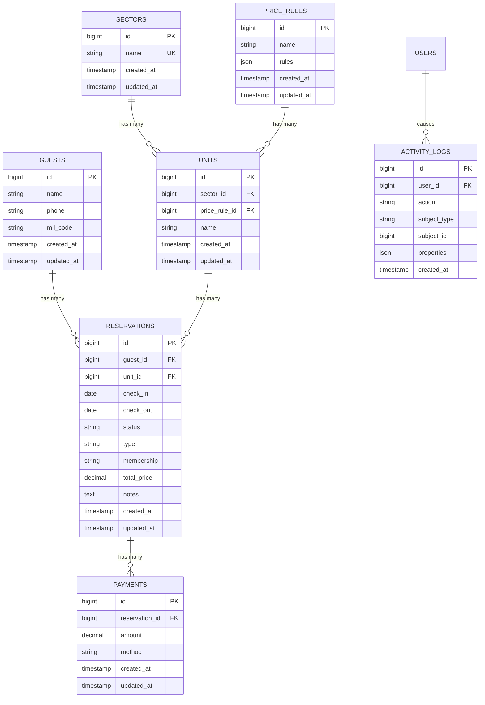
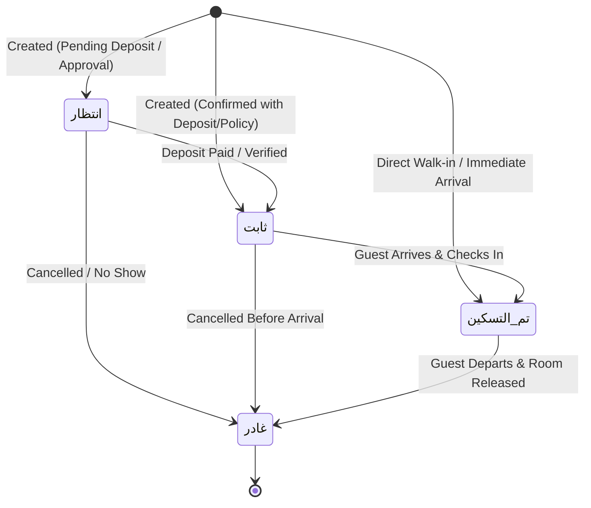

# Data Model: Eagles Resort Reservation Management System

**Feature**: `001-resort-reservation-system`  
**Date**: 2026-09-04  
**Status**: Draft  

---

## 1. Architectural Principles

1. **Relational Database**: All entities are stored in MySQL 8.x (InnoDB engine) with foreign key constraints and indexes.
2. **String Columns for Application Enums**: In accordance with system architecture rules, all enum values are managed at the application layer as PHP Backed Enums and TypeScript String Union types, and stored in MySQL as `VARCHAR` strings.
3. **Financial Integrity**: All financial calculations (`paid_amount`, `balance`, `total_price`) utilize `decimal(10,2)` to prevent floating point inaccuracies.

---

## 2. Entity Specifications



---

### 2.1 Guest (`guests`)

Represents a resort patron with contact and military/civilian identification details.

| Column | Type | Constraints | Description |
|---|---|---|---|
| `id` | `BIGINT UNSIGNED` | Primary Key, Auto-increment | Unique patron ID |
| `name` | `VARCHAR(255)` | NOT NULL | Full name of the guest |
| `phone` | `VARCHAR(50)` | NOT NULL, INDEX | Primary contact phone number |
| `mil_code` | `VARCHAR(100)` | NULLABLE, INDEX | Military or organizational ID code |
| `created_at` | `TIMESTAMP` | NOT NULL | Creation timestamp |
| `updated_at` | `TIMESTAMP` | NOT NULL | Modification timestamp |

**Relationships**:
- `hasMany(Reservation::class)`: Historical and future bookings.

**Validation Rules**:
- `name`: `required|string|max:255`
- `phone`: `required|string|max:50`
- `mil_code`: `nullable|string|max:100`

---

### 2.2 Sector (`sectors`)

Represents an administrative or geographical resort division.

| Column | Type | Constraints | Description |
|---|---|---|---|
| `id` | `BIGINT UNSIGNED` | Primary Key, Auto-increment | Unique sector ID |
| `name` | `VARCHAR(100)` | NOT NULL, UNIQUE | Sector name (e.g. "لوسيال", "فندق 6") |
| `created_at` | `TIMESTAMP` | NOT NULL | Creation timestamp |
| `updated_at` | `TIMESTAMP` | NOT NULL | Modification timestamp |

**Relationships**:
- `hasMany(Unit::class)`: Units located within this sector.

**Validation Rules**:
- `name`: `required|string|max:100|unique:sectors,name`

---

### 2.3 Price Rule (`price_rules`)

Encapsulates tiered nightly pricing rules according to membership classifications.

| Column | Type | Constraints | Description |
|---|---|---|---|
| `id` | `BIGINT UNSIGNED` | Primary Key, Auto-increment | Unique rule ID |
| `name` | `VARCHAR(255)` | NOT NULL | Pricing rule name (e.g., "تسعير شاليهات لوسيال صيف 2026") |
| `rules` | `JSON` | NOT NULL | JSON dictionary mapping membership types to rates in EGP |
| `created_at` | `TIMESTAMP` | NOT NULL | Creation timestamp |
| `updated_at` | `TIMESTAMP` | NOT NULL | Modification timestamp |

**JSON Schema for `rules`**:
```json
{
  "type": "object",
  "properties": {
    "عضو": { "type": "number", "minimum": 0 },
    "غير عضو": { "type": "number", "minimum": 0 },
    "مرافق": { "type": "number", "minimum": 0 },
    "مدني": { "type": "number", "minimum": 0 }
  },
  "required": ["عضو", "غير عضو", "مرافق", "مدني"]
}
```

**Relationships**:
- `hasMany(Unit::class)`: Units that use this pricing schedule.

---

### 2.4 Unit (`units`)

Represents an individual room, suite, villa, or chalet available for reservation.

| Column | Type | Constraints | Description |
|---|---|---|---|
| `id` | `BIGINT UNSIGNED` | Primary Key, Auto-increment | Unique unit ID |
| `sector_id` | `BIGINT UNSIGNED` | Foreign Key -> `sectors.id` (RESTRICT) | Parent sector |
| `price_rule_id` | `BIGINT UNSIGNED` | Foreign Key -> `price_rules.id` (NULL ON DELETE) | Applicable pricing rule |
| `name` | `VARCHAR(100)` | NOT NULL | Unit designation (e.g., "101", "فيلا 4") |
| `created_at` | `TIMESTAMP` | NOT NULL | Creation timestamp |
| `updated_at` | `TIMESTAMP` | NOT NULL | Modification timestamp |

**Unique Constraint**:
- `UNIQUE KEY ('sector_id', 'name')`: Unit names must be unique within a sector, allowing duplicate room numbers across different sectors/hotels.

**Relationships**:
- `belongsTo(Sector::class)`: Parent sector.
- `belongsTo(PriceRule::class)`: Linked pricing policy.
- `hasMany(Reservation::class)`: Historical and future bookings.

---

### 2.5 Reservation (`reservations`)

The central booking record coordinating guest, room, stay duration, financial obligations, and operational status.

| Column | Type | Constraints | Description |
|---|---|---|---|
| `id` | `BIGINT UNSIGNED` | Primary Key, Auto-increment | Unique reservation ID |
| `guest_id` | `BIGINT UNSIGNED` | Foreign Key -> `guests.id` (RESTRICT) | Assigned guest |
| `unit_id` | `BIGINT UNSIGNED` | Foreign Key -> `units.id` (RESTRICT) | Assigned unit |
| `check_in` | `DATE` | NOT NULL | Date of arrival |
| `check_out` | `DATE` | NOT NULL | Date of departure |
| `status` | `VARCHAR(50)` | NOT NULL | Operational status |
| `type` | `VARCHAR(50)` | NOT NULL | Reservation source / channel |
| `membership` | `VARCHAR(50)` | NOT NULL | Applied membership category |
| `total_price` | `DECIMAL(10,2)` | NOT NULL, DEFAULT 0.00 | Total booking cost in EGP |
| `notes` | `TEXT` | NULLABLE | Special requests or override explanations |
| `created_at` | `TIMESTAMP` | NOT NULL | Creation timestamp |
| `updated_at` | `TIMESTAMP` | NOT NULL | Modification timestamp |

**Compound Indexes**:
- `INDEX ('unit_id', 'status', 'check_in', 'check_out')`: High-speed conflict detection query optimization.
- `INDEX ('check_in', 'check_out')`: Fast timeline and date preset queries.

**Computed Attributes (Model Accessors)**:
- `paid_amount`: `sum(payments.amount)`
- `balance`: `max(0, total_price - paid_amount)`
- `nights_count`: `DATEDIFF(check_out, check_in)`
- `payment_status`:
  - `Fully Paid` when `paid_amount >= total_price`
  - `Partially Paid` when `paid_amount > 0 and paid_amount < total_price`
  - `Unpaid` when `paid_amount == 0`

**Validation Rules**:
- `guest_id`: `required|exists:guests,id`
- `unit_id`: `required|exists:units,id`
- `check_in`: `required|date|before:check_out`
- `check_out`: `required|date|after:check_in`
- `status`: `required|in:تم التسكين,انتظار,ثابت,غادر`
- `type`: `required|in:فرع,ادارة,منتجع`
- `membership`: `required|in:عضو,غير عضو,مرافق,مدني`
- `total_price`: `required|numeric|min:0`
- `notes`: `nullable|string|max:2000`

---

### 2.6 Payment (`payments`)

Records individual monetary transactions associated with a reservation.

| Column | Type | Constraints | Description |
|---|---|---|---|
| `id` | `BIGINT UNSIGNED` | Primary Key, Auto-increment | Unique payment ID |
| `reservation_id` | `BIGINT UNSIGNED` | Foreign Key -> `reservations.id` (CASCADE) | Linked reservation |
| `amount` | `DECIMAL(10,2)` | NOT NULL, CHECK (amount > 0) | Paid amount in EGP |
| `method` | `VARCHAR(50)` | NOT NULL | Instrument (`Cash`, `visa`, `instapay`) |
| `created_at` | `TIMESTAMP` | NOT NULL | Payment timestamp |
| `updated_at` | `TIMESTAMP` | NOT NULL | Update timestamp |

**Validation Rules**:
- `reservation_id`: `required|exists:reservations,id`
- `amount`: `required|numeric|gt:0`
- `method`: `required|in:Cash,visa,instapay`

---

## 3. Application Enums & Value Sets

### 3.1 PHP Backed Enums (`App\Enums`)

```php
namespace App\Enums;

enum ReservationStatus: string
{
    case CHECKED_IN = 'تم التسكين';
    case WAITING    = 'انتظار';
    case CONFIRMED  = 'ثابت';
    case DEPARTED   = 'غادر';
}

enum ReservationType: string
{
    case BRANCH     = 'فرع';
    case MANAGEMENT = 'ادارة';
    case RESORT     = 'منتجع';
}

enum MembershipType: string
{
    case MEMBER     = 'عضو';
    case NON_MEMBER = 'غير عضو';
    case COMPANION  = 'مرافق';
    case CIVILIAN   = 'مدني';
}

enum PaymentMethod: string
{
    case CASH     = 'Cash';
    case VISA     = 'visa';
    case INSTAPAY = 'instapay';
}
```

### 3.2 Reservation Lifecycle State Transitions



- **انتظار (Waiting)**: Provisional reservation awaiting confirmation or deposit.
- **ثابت (Confirmed)**: Confirmed booking holding unit inventory.
- **تم التسكين (Checked In)**: Guest currently occupying the unit.
- **غادر (Departed)**: Stay concluded; unit released for cleaning and subsequent guests.

